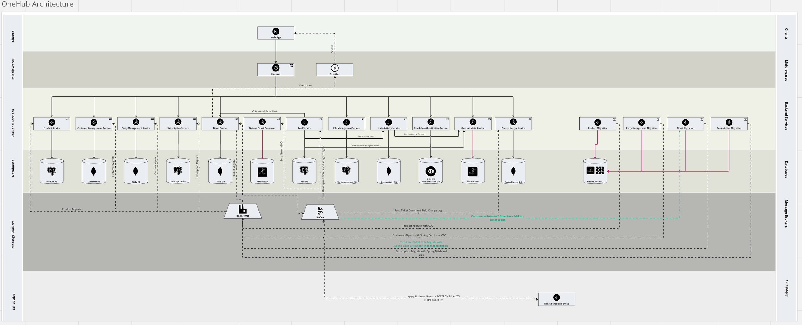
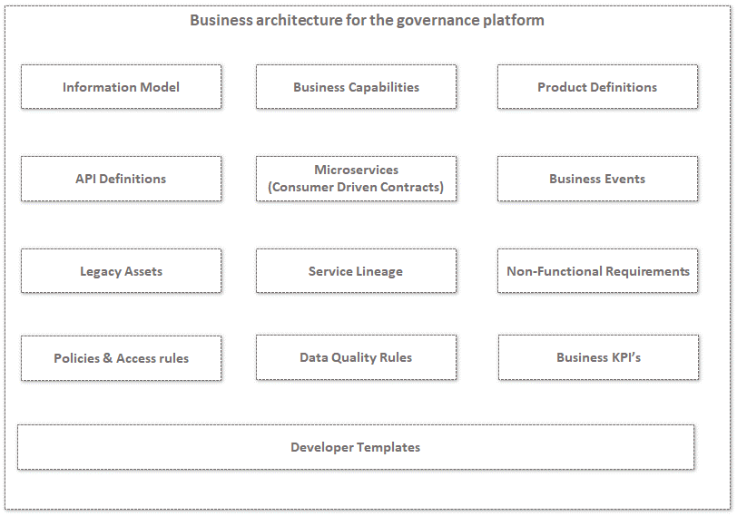
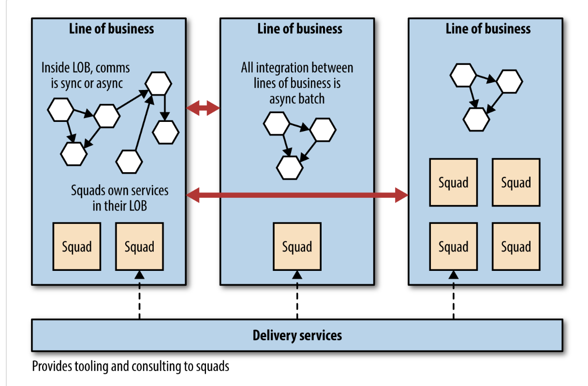
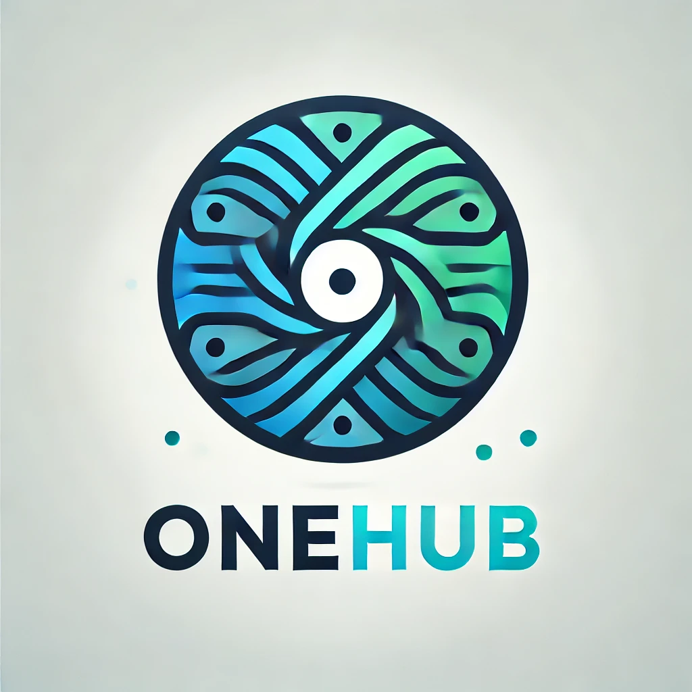
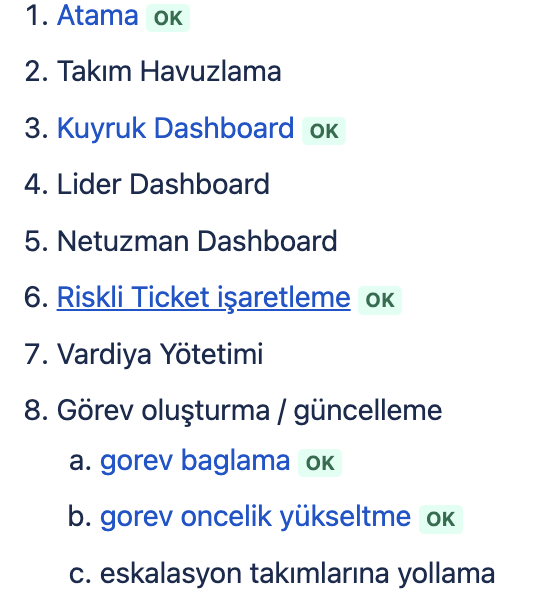
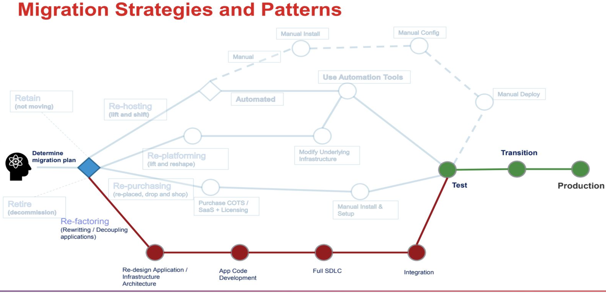

# Motivation


# Design Overview



# The 3 Keys of Microservices Governance

## Domain-Based
One of the key principles of microservices architectures is to follow domain-driven design (DDD). Having said that, our governance strategy should consider the domain as a first-class citizen wherein business or domain experts should define the information model following the DDD. The business should also be able to define the business capabilities for each of the domains from the information model.

## Product-Centric
The business should be able to easily define products from existing information models and business capabilities as well as be able to define business KPIs for products. Governance should also take care of providing a holistic view of existing products, APIs, services, and actual KPIs to the business. This will help the business to align business capabilities with end customers, quickly identify new and innovative products and measure their effectiveness.

## Platform-Thinking 
With platform-thinking, the enterprise should provide a self-service governance platform for both business as well as IT, wherein both can collaborate and align. The enterprise should be able to define global policies, standards, and guidelines through templates. Teams can build developer templates based on the tools and technologies that they have identified for their domain. The technical artifacts should be auto-generated through templates and deployed to respective run-time environments through a CI/CD pipeline, thereby automating the implementation of policies, standards, and guidelines.



# Strategy

# migration steps

1. Microservices
2. The Evolutionary Architect !!!
3. How to Model Services !!!
4. Integration
5. Splitting the Monolith !!! (we have diffrent team domains)
6. Deployment
7. Testing
8. Security
9. Conway’s Law and System Design !!!
10. Microservices at Scale
12. Bringing It All Together


# most important problems

1. The Evolutionary Architect !!!
2. How to Model Services !!!
3. Splitting the Monolith !!!
4. Conway’s Law and System Design !!!

# system overview


# 4. & 5. step details - integration styles

- [ ] Shared Tables
- [ ] Database View
- [ ] Database Materialized View
- [ ] Database Trigger
- [ ] Transactional Code
- [ ] ETL Tools
- [ ] Data Virtualization
- [ ] Event Sourcing
- [x] Change Data Capture

# Onehub - Distributed CRM System



**What is Distributed ?**
----------------

It's an in house project  [onehub](https://medium.com/turknettech/turknet-transformers-m%C3%BChendislik-ekibinde-bir-mikro-hizmet-d%C3%B6n%C3%BC%C5%9F%C3%BCm%C3%BCn%C3%BCn-hikayesi-ecb9c13865be), providing in-depth knowledge about building microservices using [spring Boot](https://spring.io/projects/spring-boot), [nodejs](https://nodejs.org/) framework and variety of tools. One of the goals, was to create a cloud agnostic solution, that you shall be able to run anywhere. Or you can reach out to tutorial from [udacity](https://classroom.udacity.com/courses/ud615) . And you can visit [fundamentals of computer sciences](https://www.youtube.com/watch?v=tpIctyqH29Q&list=PL8dPuuaLjXtNlUrzyH5r6jN9ulIgZBpdo)

**What topics will be discussed?**
----------------

A lot of them, covering different aspects of building distributed services, whether it comes to implementing the code, managing services discovery and load balancing, configuring logging or monitoring, and eventually deploying to the VM using Docker.

Just to name a few:
- [RESTful API](https://www.restapitutorial.com) implementation with [Spring Boot](https://spring.io/projects/spring-boot)
- [Consumers](https://docs.spring.io/spring-amqp/reference/amqp/receiving-messages/async-annotation-driven.html) implementation with [messaging with rabbitmq](https://spring.io/guides/gs/messaging-rabbitmq)
- [UI](https://react.dev/) implementation with [React](https://react.dev/)
- [Domain Driven Design](http://dddcommunity.org) fundamentals
- SQL and NoSQL databases ([SQL Server](https://www.microsoft.com/en-us/sql-server/sql-server-2017), [mongodb](https://www.mongodb.com)
- Distributed caching with [Redis](https://redis.io)
- [Service Layer](https://learn.microsoft.com/en-us/azure/architecture/guide/architecture-styles/n-tier), n-tier
- Using [RabbitMQ](https://www.rabbitmq.com) and [Kafka](https://kafka.apache.org/) as a message queue
- Dealing with asynchronous requests, Process Managers and Sagas
- Monitoring with [App Metrics](https://newrelic.com/), [Grafana](https://grafana.com), [Prometheus](https://prometheus.io/)
- Logging with [Log4j](https://logging.apache.org/log4j/2.x/index.html), and [ELK stack](https://www.elastic.co/elk-stack)
- Building [Docker](https://www.docker.com) images, managing containers, networks and [registries](https://hub.docker.com)
- Defining [Docker compose](https://docs.docker.com/compose) stacks
- Managing your own [nexus](https://artifact.turknet.net.tr) feeds 
- CI & CD with build services such as [Bitbucket](https://bitbucket.org/turknet-it/workspace/projects/TRANSFORMERS)
- Deploying services to the Linux Servers and configuring [Nginx](https://www.nginx.com)
- Orchestrating services on your VM or in the Cloud using [Kubernetes](https://kubernetes.io)

# ⚡ Favorite languages and tools


<code></code>
<code></code>
<code></code>
<code></code>
<code></code>
<code></code>
<code></code>
<code></code>
<code></code>
<code></code>
<code></code>
<code></code>
<code></code>
<code></code>
<code></code>
<code></code>
<code></code>
<code></code>
<code></code>


**Which repositories should I clone?**
----------------

Please clone the following repositories and put them into the same working directory:

- [helpdesk-organization-service](https://tnbilalislam@bitbucket.org/turknet-it/helpdesk-organization-service.git)
- [helpdesk-authentication-service](https://tnbilalislam@bitbucket.org/turknet-it/helpdesk-authentication-service.git)
- [helpdesk-logger-service](https://tnbilalislam@bitbucket.org/turknet-it/helpdesk-logger-service.git)
- [customer-management-service](https://tnbilalislam@bitbucket.org/turknet-it/customer-management-service.git)
- [hermes-service](https://tnbilalislam@bitbucket.org/turknet-it/hermes-service.git)
- [onehub-meta-service](https://tnbilalislam@bitbucket.org/turknet-it/onehub-meta-service.git)
- [helpdesk-central-logger-service](https://tnbilalislam@bitbucket.org/turknet-it/helpdesk-central-logger-service.git)
- [sonitel-proxy-service](https://tnbilalislam@bitbucket.org/turknet-it/sonitel-proxy-service.git)
- [sonitel-service](https://tnbilalislam@bitbucket.org/turknet-it/sonitel-service.git)
- [ticket-service](https://tnbilalislam@bitbucket.org/turknet-it/ticket-service.git)
- [ticket-migration](https://tnbilalislam@bitbucket.org/turknet-it/ticket-migration.git)
- [netone-ticket-consumer](https://tnbilalislam@bitbucket.org/turknet-it/netone-ticket-consumer.git)
- [party-management-service](https://tnbilalislam@bitbucket.org/turknet-it/party-management-service.git)
- [party-management-migration-service](https://tnbilalislam@bitbucket.org/turknet-it/party-management-migration-service.git)
- [party-role-management-service](https://tnbilalislam@bitbucket.org/turknet-it/party-role-management-service.git)
- [state-activity-service](https://tnbilalislam@bitbucket.org/turknet-it/state-activity-service.git)
- [channel-service](https://tnbilalislam@bitbucket.org/turknet-it/channel-service.git)
- [subscription-service](https://tnbilalislam@bitbucket.org/turknet-it/subscription-service.git)
- [subscription-migration](https://tnbilalislam@bitbucket.org/turknet-it/subscription-migration.git)
- [product-service](https://tnbilalislam@bitbucket.org/turknet-it/product-service.git)
- [product-migration](https://tnbilalislam@bitbucket.org/turknet-it/product-migration.git)
- [tn.onehub.main](https://tnbilalislam@bitbucket.org/turknet-it/tn.onehub.main.git)
- [file-manager-service](https://tnbilalislam@bitbucket.org/turknet-it/file-manager-service.git)
- [poseidon-service](https://tnbilalislam@bitbucket.org/turknet-it/poseidon-service.git)
- [helpdesk-schedule-service](https://tnbilalislam@bitbucket.org/turknet-it/helpdesk-schedule-service.git)
- [tn.onehub.ui.task](https://tnbilalislam@bitbucket.org/turknet-it/tn.onehub.ui.task.git)
- [onehub-team-user-status-check](https://tnbilalislam@bitbucket.org/turknet-it/onehub-team-user-status-check.git)
- [turknet-service](https://tnbilalislam@bitbucket.org/turknet-it/turknet-service.git)
- [modular-core-sdk](https://tnbilalislam@bitbucket.org/turknet-it/modular-core-sdk.git)

**How to build with docker compose ?**
----------------
```sh
$ cd scripts
$ sh git-clone-onehub.sh
$ docker-compose -f docker-compose-onehub.yaml up
$ tilt -f Tiltfile-onehub
```

**How to build with tilt?**
----------------
```sh
$ sh git-clone-onehub.sh
$ tilt up -f Tiltfile-onehub
$ tilt down -f Tiltfile-onehub
```


# TechStack
you can reach out the tech stack [here](https://stackshare.io/turknet-transformers-team/transformers)

## Roadmap DB


## Our Core Pilars
* Simple design
* Automate repetitive tasks
* TDD
* CI
* DDD
* SOLID
* Clean Code
* Fast Feedback
* Continuous Delivery
* Stable and repeatable release processes


# Scale Pilars


# Migration Strategy from container to k8s



# Useful Links
* [product medium article](https://medium.com/turknettech/turknet-transformers-m%C3%BChendislik-ekibinde-bir-mikro-hizmet-d%C3%B6n%C3%BC%C5%9F%C3%BCm%C3%BCn%C3%BCn-hikayesi-ecb9c13865be)

* [technic medium article](https://medium.com/turknettech/turknet-transformers-m%C3%BChendislik-ekibinde-bir-mikro-hizmet-d%C3%B6n%C3%BC%C5%9F%C3%BCm%C3%BCn%C3%BCn-hikayesi-teknik-perspektif-5bd91e145af9)


# A Lessons in Learned

PS : The art of system design is the Picking the right architecture = Picking the right battles + Managing trade-offs